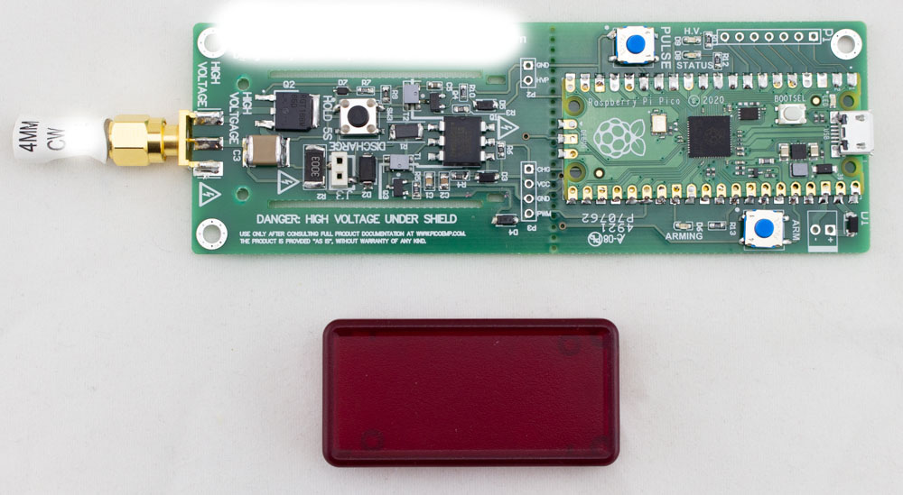
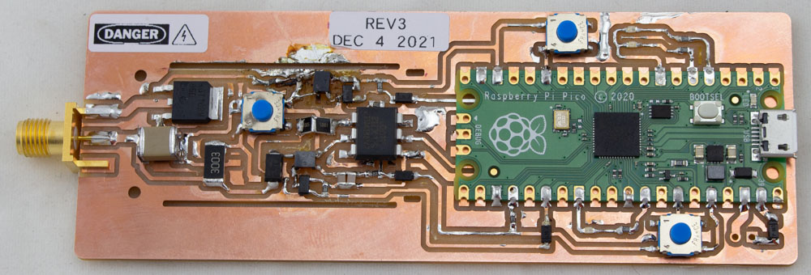
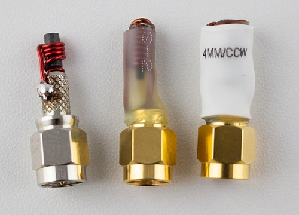

# ChipSHOUTER-PicoEMP

[![CC BY-SA 3.0][cc-by-sa-shield]][cc-by-sa]

The PicoEMP is a low-cost Electromagnetic Fault Injection (EMFI) tool, designed *specifically* for self-study and hobbiest research. Under the safety shield it looks like this:

## Building a PicoEMP

The PicoEMP uses a Raspberry Pi Pico as the controller, inspired by @nezza using it for the debug-n-dump tool. You could alternatively use an Arduino or another microcontroller. You basically just need a few things:

1. PWM output to drive HV transformer.
2. Pulse pin to generate a pulse.
3. Status pin to monitor the HV status.

You have two options for building the PicoEMP: (1) total scratch build, or (2) easy-assemble build.

### Scratch Build

The PCB is *mostly* one layer. Original versions of it were milled on a Bantam PCB mill, and the final 'production' version is designed
to still allow this simple milling process. You can find details in the [gerbers](hardware/gerbers) folder, including Bantam-optimized files
which remove some of the smaller vias (used for the mounting holes), and require you to surface-mount the Raspberry Pi Pico. Here was
'rev3' of the PCB with a few hacked up tests:

If you've got time you can order the "real" PCBs from the [gerbers](hardware/gerbers) as well.

The BOM and build details are described in the [hardware](hardware) folder. If you cannot find the plastic shield (the upper half of Hammond
1551BTRD is used), you can find a simple 3D-printable shield as well. The official shield is low-cost and available from Digikey/Mouser/
Newark so you can purchase alongside everything else you need.

**IMPORTANT**: The plastic shield is critical for safe operation. While the output itself is isolated from the input connections, you will still **easily shock yourself** on the exposed high-voltage capacitor and circuitry. **NEVER** operate the device without the shield.

### Programming the PicoEMP

You'll need to program the PicoEMP with the firmware in the [firmware](firmware) directory. You can run other tasks on the microcontroller
as well.

### Building the EM Injection Tip (Probe / Coil)

You will also need an "injection tip", typically made with a ferrite core and some wires wrapped around it. You can see examples of such cores in the ChipSHOUTER kit. The following shows a few homemade & commercial tips:

You can make your own from suitable SMA connectors, magnet wire, and a ferrite core material. See the [injection_tips](hardware/injection_tips)
folder for more examples and details on building the probes.

*Reader Note: Please submit your own examples with a pull-request to this repo, it would be great to have more examples of probe geometries*

You can find additional examples of homemade cores in research papers such as:

* A. Cui, R. Housley, "BADFET: Defeating Modern Secure Boot Using Second-Order Pulsed Electromagnetic Fault Injection," USENIX Workshop on Offensive Technologies (WOOT 17), 2017.  [Paper Link.](https://www.usenix.org/conference/woot17/workshop-program/presentation/cui) [Slides Link.](https://github.com/RedBalloonShenanigans/BADFET)
* J. Balasch, D. Arumí and S. Manich, "Design and validation of a platform for electromagnetic fault injection," 2017 32nd Conference on Design of Circuits and Integrated Systems (DCIS), 2017, pp. 1-6. [Paper Link.](https://upcommons.upc.edu/bitstream/handle/2117/116688/bare_conf.pdf)
* J. Toulemont, G. Chancel, J. M. Galliere, F. Mailly, P. Nouet and P. Maurine, "On the scaling of EMFI probes," 2021 Workshop on Fault Detection and Tolerance in Cryptography (FDTC), 2021. [Paper Link.](https://ieeexplore.ieee.org/abstract/document/9565575) [Slides Link.](https://jaif.io/2021/media/JAIF2021%20-%20Toulemont.pdf)
* LimitedResults. "Enter the Gecko," 2021. [Blog Link](https://limitedresults.com/2021/06/enter-the-efm32-gecko/)

## Using the PicoEMP

The general usage of the PicoEMP is as follows:

1. Press the "ARM" button. The red "ARMING" led will come on instantly telling you it's trying to charge the high voltage.
2. The red "HV" led will come on after a few seconds saying it is charged to "some voltage".
3. Place the probe tip overtop of the target.
4. Press the "Pulse" button.

**WARNING**: The high voltage will be applied across the SMA connector. If an injection tip (coil) is present, it will absorb most of the power. If you leave the SMA connector open, you will present a high voltage pulse across this SMA and could shock yourself. Do NOT touch the output SMA tip as a general "best practice", and treat the output as if it has a high voltage present.

## About the High Voltage Isolation

Most EMFI tools generate high voltages (similar to a camera flash). Many previous designs of open-source EMFI tools would work well, but [exposed the user to high voltages](https://github.com/RedBalloonShenanigans/BADFET). This was fine provided you use the tool correctly, but of course there is always a risk of grabbing the electrically "hot" tool! This common design choice happens because the easiest way to design an EMFI tool is with "low-side switching". With low-side switching the output connector is always "hot", which presents a serious shock hazard.

PicoEMP gets around this problem by floating the high-voltage side, meaning there is no electrical path between the EMFI probe output and the input voltage ground. With the isolated high voltage output we can use the simple "low-side switching" in a safe manner. Some current will still flow due to the high-frequency spikes, so this isn't *perfect*, but it works well enough in practice (well enough you will shock yourself less often).

The caveat here is for this to work you also need to isolate your gate drive. There are a variety of [solutions to this](https://www.analog.com/en/technical-articles/powering-the-isolated-side-of-your-half-bridge-configuration.html), with the simplist being a gate drive transformer (GDT). The PicoEMP uses the transformer architecture, with some simplifications to further reduce BOM count.

More details of the design are available in the [hardware](hardware) folder.

### Hipot Testing for Validating Isolation

For better safety, you can apply a hi-pot test.

This test applies a high voltage (1000V) from the SMA connector pads to the low-voltage signals shorted together. The test is done at 1000V DC, with test passing if LESS than 1 uA of current flows over the 60 seconds test duration. Note this limits is *far* lower than most industry standard limits.

## License

This work is licensed under a [Creative Commons Attribution-ShareAlike 3.0 International License][cc-by-sa].

[cc-by-sa]: http://creativecommons.org/licenses/by-sa/3.0/
[cc-by-sa-image]: https://licensebuttons.net/l/by-sa/3.0/88x31.png
[cc-by-sa-shield]: https://img.shields.io/badge/License-CC%20BY--SA%203.0-lightgrey.svg
